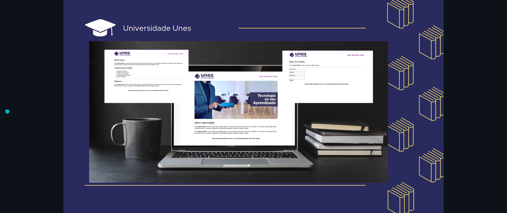
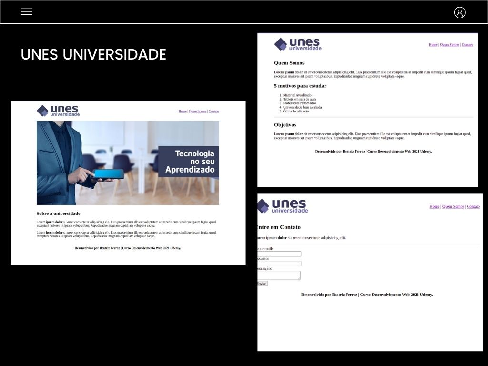

# Faculdade-Unes P(Página institucional de uma universidade fictícia)

<h3 align="center">
    <a href="">Acessar a demonstração</a>
<h3 >

# Indice

- [Sobre](#-sobre)
- [Protótipo](#-prototipo)
- [Tecnologias Utilizadas](#-tecnologias-utilizadas)

## 🔖&nbsp; Sobre

Projeto **FACULDADE UNIS** é uma Página institucional de uma universidade desenvolvido durante o **Curso Desenvolvimento Web pela Udemy** com o intuito de colocarmos em prática todo conteúdo estudado durante o módulo de HTML5 básico.

---
## 🚀 Prototipo

---

## 🚀 Tecnologias utilizadas

O projeto foi desenvolvido utilizando as seguinte tecnologia

- [HTML5](https://www.w3schools.com/html/)

---
### Desenvolvido por:
* [Beatriz Ferraz](https://github.com/bea-ferraz)
